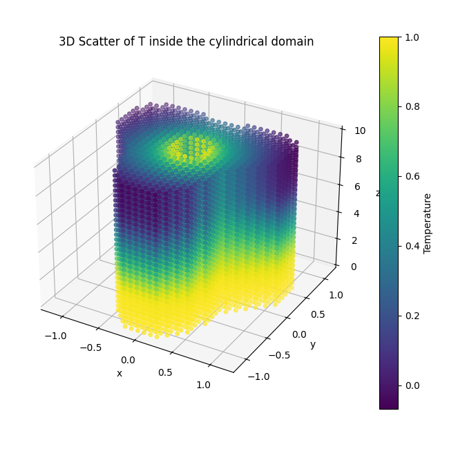

[](https://github.com/sck-at-ucy/kbeta-pinn3d/actions/workflows/ci.yml) [](https://github.com/sck-at-ucy/kbeta-pinn3d/actions/workflows/ci.yml) [](https://pypi.org/project/kbeta-pinn3d/) [](https://doi.org/10.5281/zenodo.XXXXXXX)

<p align="center">
  
  
</p>

# kbeta‑pinn3d – *A 3‑D Cylindrical Physics‑Informed Neural Network powered by Kourkoutas‑β*  🌞🦎🧊📐

> **Research companion code for the upcoming paper**  
> “Kourkoutas-β: A Sunspike-Driven Adam Optimizer with Desert Flair.”  
> Published as [arXiv:2508.12996](http://arxiv.org/abs/2508.12996).
>
> This repository contains the full **3‑D steady‑heat PINN** workload that showcases the optimiser on a complex mixed‑boundary problem.
> (see the separate [`kbeta`](https://github.com/sck-at-ucy/kbeta) repo), plus lightweight utilities for training, evaluation and visualisation.


---

## Table of Contents
1. [Why a 3‑D PINN?](#why-a-3-d-pinn)
2. [Model highlights](#model-highlights)
3. [Project layout](#project-layout)
4. [Quick start](#quick-start)
5. [Installation](#installation)
6. [Training from scratch](#training-from-scratch)
7. [Using your own geometry](#using-your-own-geometry)
8. [Tests and linting](#tests-and-linting)
9. [Command-line options](#command-line-options)
10. [Relation to Kourkoutas-β](#relation-to-kourkoutas-β)
11. [Citation](#citation)
12. [License](#license)

---

## Why a 3‑D PINN?
Classical ML benchmarks rarely **stress second‑moment tracking** because their
loss landscapes are well‑conditioned.  
The **cylindrical PINN** provides:

* Extreme scale separation (inner vs outer radius & long aspect‑ratio $L_z/r$).  
* **Piece‑wise flux** & Neumann edges that provoke gradient spikes.  
* A moderate parameter budget (≈ 200 k) → runs on a single Apple‑GPU in < 30 min.

This makes it an *excellent* stress‑test for Kourkoutas‑β’s adaptive β₂ logic.

---

## Model highlights
| Feature | What it means | Why it matters |
|---------|---------------|----------------|
| **Cylindrical Laplacian** coded *analytically* | No autodiff‑derived PDE residual – we write the terms explicitly. | keeps compute graph tiny; MLX JIT can fuse the custom op. |
| **Mixed BCs** (Dirichlet, Neumann, flux) | Complex outer wall $r=r_{\max}+0.25\,r_{\max}\sin3\theta$. | amplifies gradient variance → showcases optimiser behaviour. |
| **Periodic θ coupling** | Enforces both $T$ and $\partial T/\partial\theta$. | avoids mesh duplication; tests multi‑loss balancing. |
| **Spike/β₂ tracking hooks** built‑in | 1‑line opt‑in via `--collect_spikes`. | produces violin & density plots (see *plot_utils*). |
| **Pure‑MLX implementation** | Runs out‑of‑the-box on Apple Silicon (`pip install mlx`). | zero PyTorch/TensorFlow deps. |

---

## Project layout
```
kbeta-pinn3d
├── src/kbeta_pinn3d/
│   ├── __init__.py          # exposes `pinn3d.main`
│   ├── pinn3d.py            # monolithic training script
│   └── utils/
│       ├── plotting.py      # sun‑spike, β₂ violin / heat‑maps
│       └── visualization.py # 2‑D slice & 3‑D scatter helpers
├── tests/
│   ├── test_smoke.py        # import smoke test
│   └── test_forward.py      # tiny forward pass
├── .github/workflows/ci.yml # macOS‑14 MLX CI
└── pyproject.toml
```

---

## Quick start
```bash
git clone git@github.com:sck-at-ucy/kbeta-pinn3d.git
cd kbeta-pinn3d
python -m venv .venv && source .venv/bin/activate
pip install -e ".[dev]"   # installs MLX & plotting stack

# 1‑minute smoke run (2 000 epochs, Adam‑95)
python -m kbeta_pinn3d.pinn3d --optimizer adam95 --epochs 2000 --viz
```

---

## Installation

### Option 1: PyPI wheels (end‑users)
If you only want to run the **PINN3D** benchmark with the latest `kbeta`:

```bash
pip install kbeta-pinn3d
```

For dev tools and tests:

```bash
pip install "kbeta-pinn3d[dev]"
```

For visualisation/plotting extras (matplotlib, seaborn, pandas):

```bash
pip install "kbeta-pinn3d[viz]"
```

---

### Option 2: Cloning the repo (researchers / contributors)

```bash
git clone https://github.com/sck-at-ucy/kbeta-pinn3d.git
cd kbeta-pinn3d
python -m venv .venv && source .venv/bin/activate
pip install -e ".[dev]"
```

This makes all configs and scripts editable for research use.

---

## Training from scratch
```bash
# Full experiment (20 k epochs) with Kourkoutas‑β + diagnostics
python -m kbeta_pinn3d.pinn3d        --optimizer kourkoutas        --epochs    20000             --kour_diagnostics            --collect_spikes              --viz
```
Output directories:

```
plots/
 ├─ sunspike_violin/   *.png
 ├─ sunspike_heatmap/  *.png
 ├─ beta2_violin/      *.png
 ├─ beta2_heatmap/     *.png
 └─ fields/            slice_Z=0.0.png, ...
```

---

## Using your own geometry
All geometry & sampling constants sit at the **top of `pinn3d.py`**:
```python
r_min     = 0.2          # inner radius
r_max     = 1.0          # mean outer radius
length_z  = 10.0 * r_max # cylinder length
num_interior = 4000
num_boundary = 2000
```
Change them, re‑run, done.  
Boundary helpers (`piecewise_flux`, `compute_normal_derivative_3D_outer`) are
stand‑alone functions; swap in your own.

---

## Tests and linting
```bash
pytest -q            # should print ‘2 passed’
ruff check .         # style / import / naming
mypy src             # optional static typing pass
```

CI enforces all of the above on **macOS‑14 (arm64)** runners.

---

## Command-line options
Overriding defaults:

| Flag | Default | Purpose |
|------|---------|---------|
| `--optimizer {adam95, adam999, kourkoutas}` | `kourkoutas` | Select the optimiser. |
| `--epochs N` | `6000` | Number of training iterations. |
| `--seed N` | `0` | Random seed for **both** mesh & model init. |
| `--viz` | *(off)* | Produce 2‑D/3‑D field plots after training. |
| `--kour_diagnostics` | *(off)* | Collect lightweight per‑epoch diagnostics (≈ 2 % overhead). |
| `--collect_spikes` | *(off)* | Store **sun‑spike**/β₂ history for violin & heat‑maps. |

> **Notes on spike tracking**  
> To actually record Sun‑spike/β₂ you need **all** of: `--optimizer=kourkoutas`, `--kour_diagnostics`, **and** `--collect_spikes`. Enabling `--collect_spikes` auto-enables `--kour_diagnostics` as well.  
> The windowing/plot stride is controlled via `--window` and `--stride`.  
> `--window N` ↦ Spikes are first aggregated over N epochs (default = 500). Each window → one violin.  
> `--stride M` ↦ Keep only every M‑th violin after aggregation (default = 10×window).

---

## Example runs

Adam with β₂ = 0.95 for 2 k epochs + field plots
```bash
python -m kbeta_pinn3d.pinn3d --optimizer adam95 --epochs 2000 --viz
```

---

Full 100 k‑epoch paper run with Kourkoutas‑β diagnostics & spike plots
```bash
python -m kbeta_pinn3d.pinn3d        --optimizer kourkoutas        --epochs    100000             --kour_diagnostics            --collect_spikes              --viz
```

The paper runs were made with the following default hyperparams for Kourkoutas-β

```python
    optimizer = KourkoutasBeta(
        learning_rate= lr_schedule,
        beta1=0.90,
        beta2_max=0.999,
        beta2_min=0.88,
        eps=1e-8,
        alpha=0.93,
        tiny_spike=1.e-9,
        tiny_denom=1.e-8,
        decay=0.98,
        adaptive_tiny=True,
        max_ratio=3,
        warmup_steps=0,
        bias_correction="beta2max",
        layer_key_fn=lambda p: p.shape,
        diagnostics= ARGS.kour_diagnostics
    )
```

---

## Relation to Kourkoutas-β
This workload is the **PDE‑heavy sibling** to the 2‑D Transformer demo in
[`kbeta-transformer2d`](https://github.com/sck-at-ucy/kbeta-transformer2d).  
Both share the same optimiser code (`kbeta.optim.KourkoutasBeta`) but
stress *different* regimes:

| Repo | Regime tested |
|------|---------------|
| `transformer2d` | Dense **autoregressive** gradients, low wall‑clock per step |
| `pinn3d` | Sparse **PDE‑residual** gradients, high variance, complex BCs |

---

## Citation

If you use this work, please cite both the **paper** and the **software archive**:

**Paper (arXiv preprint)**  
```bibtex
@article{Kassinos2025Kourkoutas,
  title   = {Kourkoutas-β: A Sunspike-Driven Adam Optimizer with Desert Flair},
  author  = {Stavros Kassinos},
  journal = {arXiv preprint arXiv:2508.12996},
  year    = {2025},
  url     = {https://arxiv.org/abs/2508.12996}
}
```

**Software (Zenodo archive)**  
```bibtex
@software{kassinos2025pinn3d,
  author       = {Stavros Kassinos},
  title        = {kbeta-pinn3d: 3-D Cylindrical Physics-Informed Neural Network – Companion Code},
  year         = {2025},
  publisher    = {Zenodo},
  version      = {1.0.0},
  doi          = {10.5281/zenodo.XXXXXXX},
  url          = {https://doi.org/10.5281/zenodo.XXXXXXX}
}
```

---

## License
Distributed under the MIT License – see [`LICENSE`](LICENSE) for full text.

Happy diffusing 🔥🦎❄️
